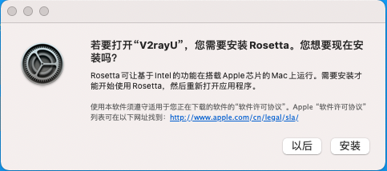

# DevOps 工程师的 macOS 搭建指南

## Why

本项目的灵感来自于 [Phodal Huang](https://github.com/phodal)  的项目 [setup.guide](https://github.com/phodal/setup.guide) , 觉得这种总结的方式十分的好，方便以后从无到有地搭建一个合适宜用的macOS环境。~~加之我的RMBP因为苹果的电池🔋召回计划而返厂维修，自己把所有的数据清空了，刚好进行本项目的尝试。~~ 刚好趁着Apple暑期计划，购买了新的M1 Mac Mini，可以在一个新的 macOS 上实施这个项目

## What

这是一个绝大多数靠命令行（Homebrew），安装 macOS 软件的仓库。
对于需要在网站下载dmg、pkg等软件、或者在Mac App Store下载的软件，请参照我的另一个仓库：
[Mac-Software-In-Use](https://github.com/MiracleWong/Mac-Software-In-Use)

对于M1 Mac Mini等搭载苹果最新 M1 芯片的机器，需要软件额外的支持，具体查询网站如下：

- [Does it ARM](https://doesitarm.com/)
- [is apple silicon ready](https://isapplesiliconready.com/zh)

从软件收集数量来看，Does it ARM 更胜一筹；从提交情报方式来看，Does it ARM 采用开源平台、情报公示，而项目 is apple silicon ready 通过 Google 表单提交给主理人，Does it ARM 更胜一筹；从美观度和易用性来看，项目 is apple silicon ready 为每个软件设置了图标、做了分页处理、每行高度适中，完胜 Does it ARM。<sup>[1]</sup>

## How

**重要的事情说说三遍：**

安装过程和配置文件(dotfiles)已经自动化。

安装过程和配置文件(dotfiles)已经自动化。

安装过程和配置文件(dotfiles)已经自动化。

地址：[MiracleWong/dotfiles: Manage my dotfiles by rcm.](https://github.com/MiracleWong/dotfiles)

1. Install Xcode
  
    备注：在Mac App Store 上安装

2. Install Xcode命令行工具

    ```
    xcode-select --install
    ```

3. Install Rosetta（罗塞塔）

    

    备注：
    - 首次打开为基于 Intel 的 Mac 构建的 App 时，系统会要求您安装 Rosetta（罗塞塔）。
    - [如果您需要在 Mac 上安装 Rosetta - Apple 支持 (中国)](https://support.apple.com/zh-cn/HT211861)

4. Install Homebrew

    ```
    /usr/bin/ruby -e "$(curl -fsSL https://raw.githubusercontent.com/Homebrew/install/master/install)"
    ```
    
    如果网络条件不允许，请进行K（科）X（学）S（上）W（网）的方法，或者
    
    ```
    git clone --depth=1 https://mirrors.tuna.tsinghua.edu.cn/git/homebrew/install.git brew-install
    /bin/bash brew-install/install.sh
    rm -rf brew-install
    ```

    官方地址：[Homebrew](https://brew.sh/index_zh-cn)

5. 更改Homebrew的配置

    [Homebrew 镜像使用帮助](https://mirrors.tuna.tsinghua.edu.cn/help/homebrew/)
    记得区分自己的机器是M1芯片（arm64）的、还是Intel芯片的（x86_64）的。

6. Python

    ```
    brew install python@3.10
    ```

7. 日常使用工具

    ```
    brew install --cask appcleaner google-chrome microsoft-edge flux iina one-switch mweb-pro qq wechat licecap tencent-lemon maczip hiddenbar obsidian itsycal hazeover eudic calibre
    ```
    
    备注：
    - 使用brew 下载的 firefox 是国外版本，其账号系统和国内的火狐是不通的
    - 迅雷（thunder），不再使用
    - [Usage](https://usage.pro/)（usage） 不再使用，改用腾讯开源的柠檬清理（tencent-lemon）
    - One Swithc（one-switch）、MWeb Pro（mweb-pro） 均需要付费，请谨慎选择
    - virtualbox 不再使用，原因：暂时没有建立虚拟机的需求，已经购买了云主机
    - 网易云音乐（neteasemusic）Homebrew 下载的经常有小问题，排查未果后，现通过[官方网站下载](https://music.163.com/#/download)


8. 编程效率工具

    ```
    brew install --cask iterm2 sourcetree alfred postman picgo upic switchhosts dash cheatsheet
    ```
    
    备注：Alfred 5（alfred）的PowerPack 需要付费。
    

9. 扩展预览程序<sup>[2]</sup>

    ```
    brew install --cask qlcolorcode qlimagesize qlmarkdown qlmobi qlstephen qlvideo quicklook-json quicklook-csv  webpquicklook ipynb-quicklook
    ```

10. 命令行工具

    ```
    brew install wget curl mycil httpie lftp lrzsz jq xz coreutils autojump shellcheck htop axel cloc thefuck wtf fzf exa bat tmux gh youtube-dl imagemagick restic
    ```
    
    备注：已买的M1 Mac Mini 自带了git（前面安装过homebrew），这里不再安装

11. 编辑器：Visual Studio Code
    
    ```
    brew install --cask visual-studio-code
    ```

12. Node

    ```
    brew install node
    ```

13. NVM

    ```
    curl -o- https://raw.githubusercontent.com/nvm-sh/nvm/v0.39.1/install.sh | bash
    ```

    官方地址：[nvm](https://github.com/nvm-sh/nvm)，可以查看具体的`nvm/install.sh`的版本。

    备注：12 和 13 选择一种方式即可。

14. ZSH 和 oh-my-zsh
    
    备注：macOS上默认自带zsh，这里不再安装。

    ```
    which zsh
    zsh --version
    ```

    安装oh-my-zsh
    ```
    sh -c "$(curl -fsSL https://raw.github.com/ohmyzsh/ohmyzsh/master/tools/install.sh)"
    ```
    
    如果网络条件不允许，请进行K（科）X（学）S（上）W（网）的方法，或者

    ```
    sh -c "$(curl -fsSL https://gitee.com/mirrors/oh-my-zsh/raw/master/tools/install.sh)"
    ```

    配置`~/.zshrc`
    ```
    cp ~/.oh-my-zsh/templates/zshrc.zsh-template ~/.zshrc
    ```


15. JDK（存疑，待修订）

    ```
    brew install --cask openjdk@11
    ```


[1]: https://www.pokooo.com/6808.html
[2]: https://github.com/sindresorhus/quick-look-plugins